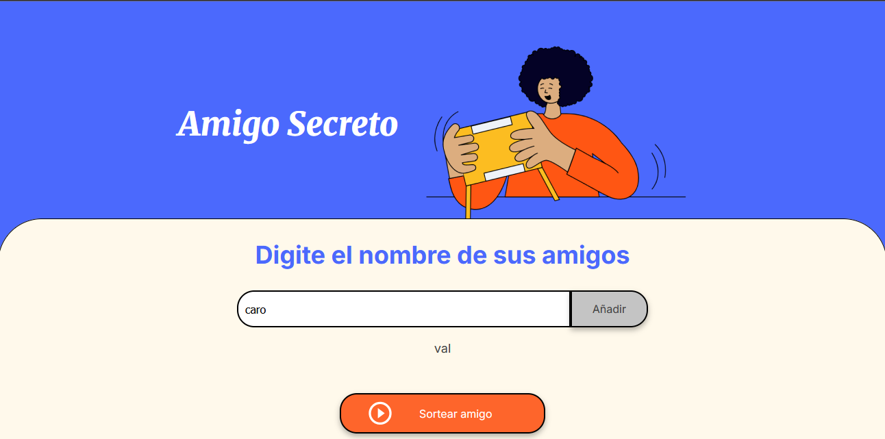

# Challenge amigo secreto

Este proyecto es una aplicación web sencilla que permite a los usuarios ingresar nombres de amigos en una lista y realizar un sorteo aleatorio para determinar quién será su "amigo secreto".

## Funcionalidades

- **Agregar nombres:**  
  Puedes escribir un nombre en el campo de texto y agregarlo a la lista haciendo clic en el botón **"Añadir"** o presionando **Enter**.

- **Validación de entrada:**  
  - Si el campo de texto está vacío, se mostrará una alerta indicando que deben ingresar un nombre.
  - No se permiten nombres duplicados en la lista.

- **Visualización de la lista:**  
  - Los nombres ingresados aparecerán en una lista visible debajo del campo de entrada.
 

- **Sorteo aleatorio:**  
  Al hacer clic en el botón **"Sortear Amigo"**, se seleccionará un nombre de la lista de manera aleatoria y se mostrará en pantalla.

